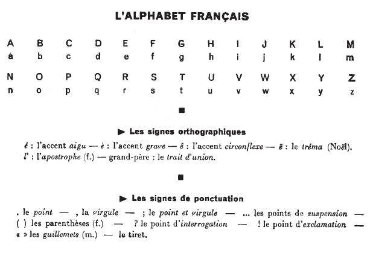
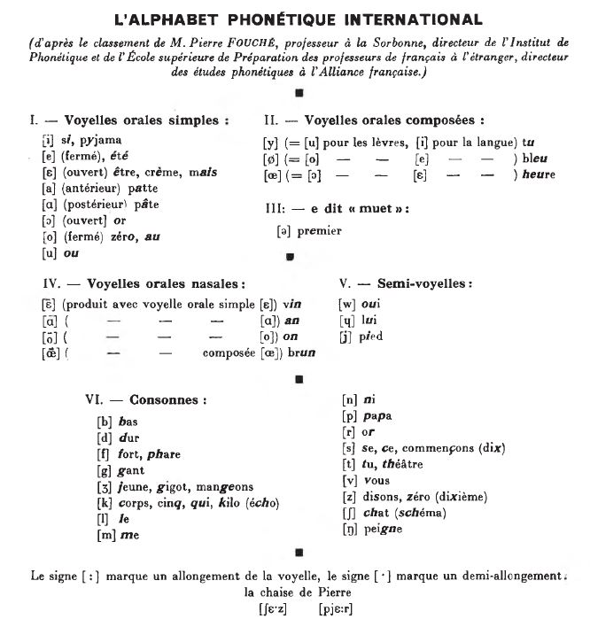

## Alphabet et phonétique

<iframe width="560" height="315" src="https://www.youtube.com/embed/8WnTgEzcqaw" frameborder="0" allow="accelerometer; autoplay; encrypted-media; gyroscope; picture-in-picture" allowfullscreen></iframe>

  <a href='ekler.html' title='Önceki sayfa'>⇦</a>&emsp;
  <a href='index.html' title='Ana sayfa'>⇧</a>&emsp;
  <a href='ders/01.html' title='Sonraki sayfa'>⇨</a>

