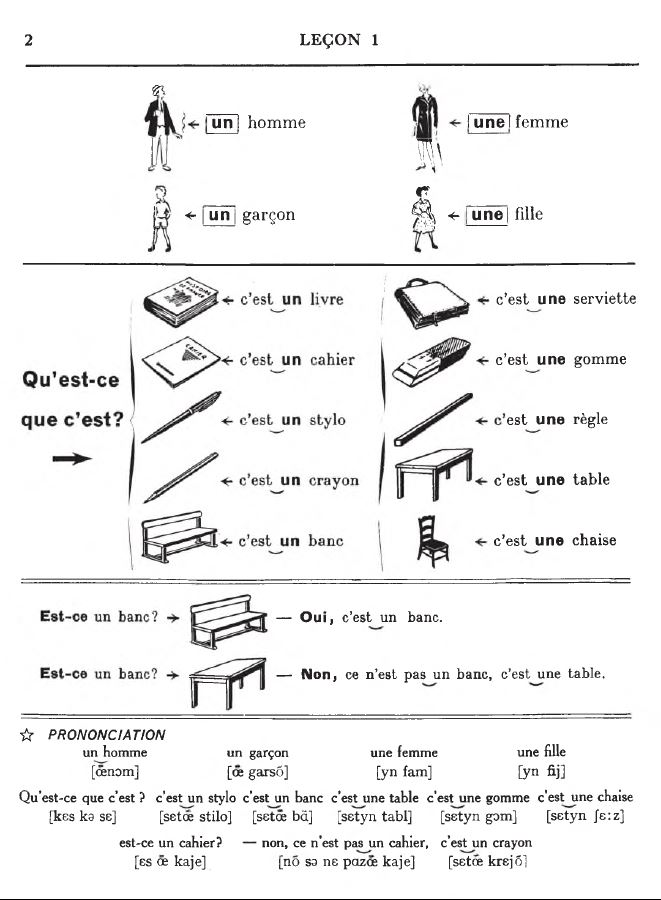
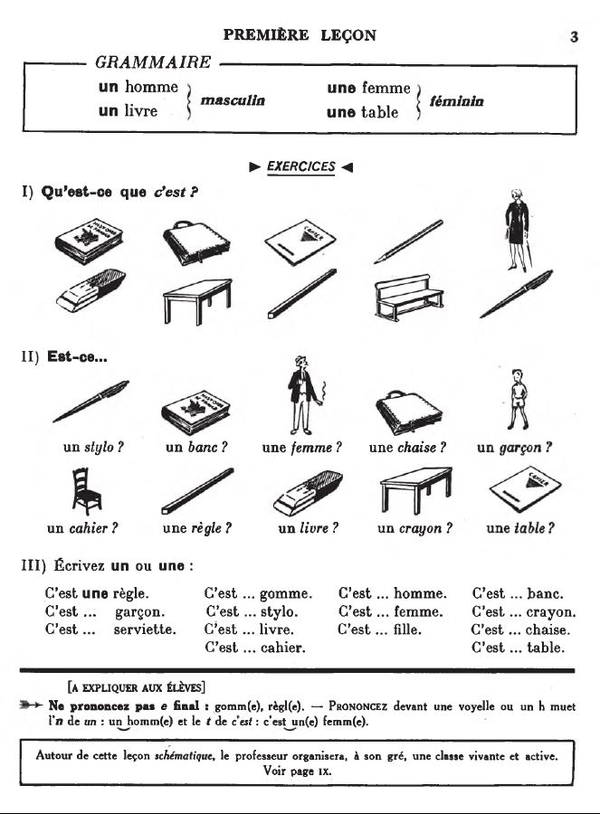

## 01. Qu’est-ce que c’est?

  <audio controls>
    <source src="sound/01A.ogg"></source>
  </audio>

  <audio controls>
    <source src="sound/01B.ogg"></source>
  </audio>

<iframe width="560" height="315" src="https://www.youtube.com/embed/jplbnk35sKo" frameborder="0" allow="accelerometer; autoplay; encrypted-media; gyroscope; picture-in-picture" allowfullscreen></iframe>

  <a href='../alfabe.html' title='Önceki sayfa'>⇦</a>&emsp;
  <a href='..' title='Ana sayfa'>⇧</a>&emsp;
  <a href='02.html' title='Sonraki sayfa'>⇨</a>

