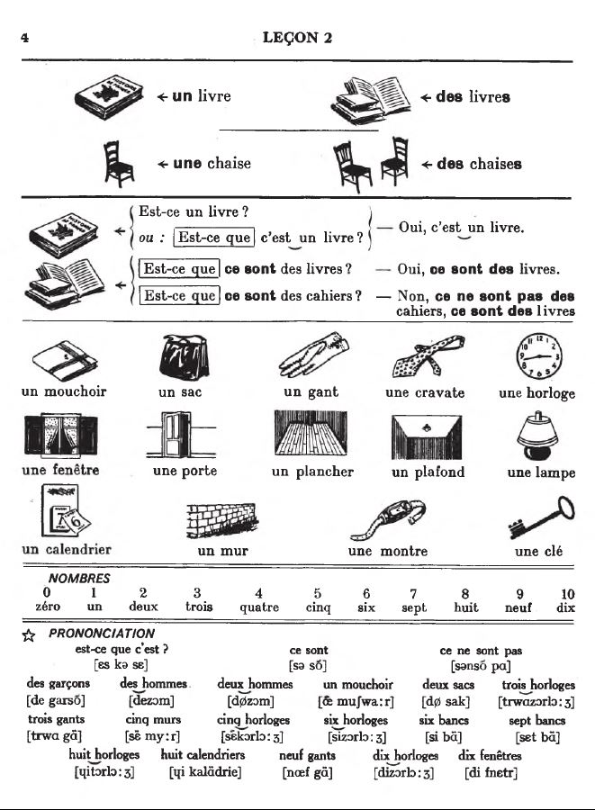
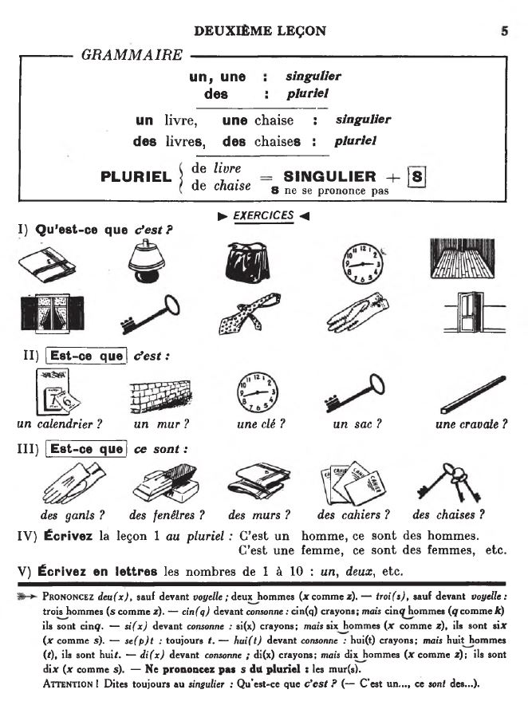

## 02. Un, une, des

  <audio controls>
    <source src="sound/02A.ogg"></source>
  </audio>

  <a href='01.html' title='Önceki sayfa'>⇦</a>&emsp;
  <a href='..' title='Ana sayfa'>⇧</a>&emsp;
  <a href='03.html' title='Sonraki sayfa'>⇨</a>

