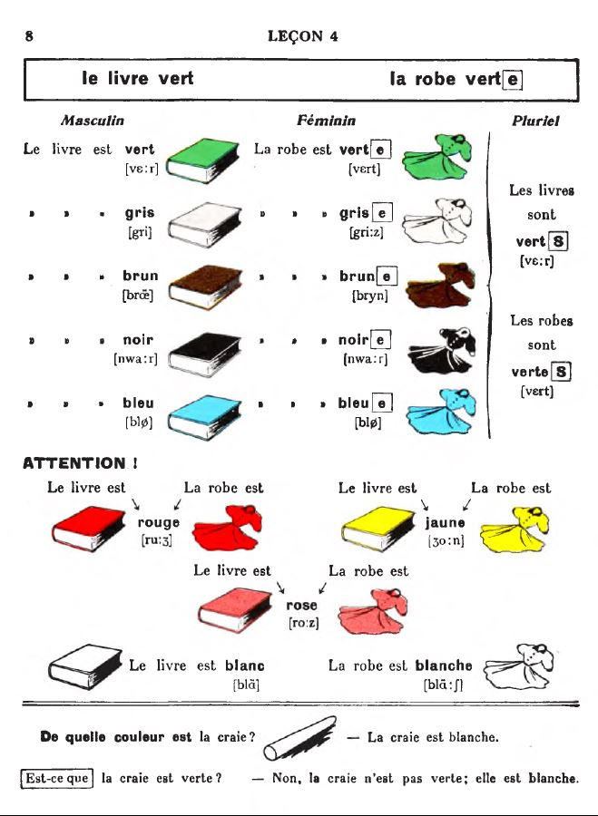
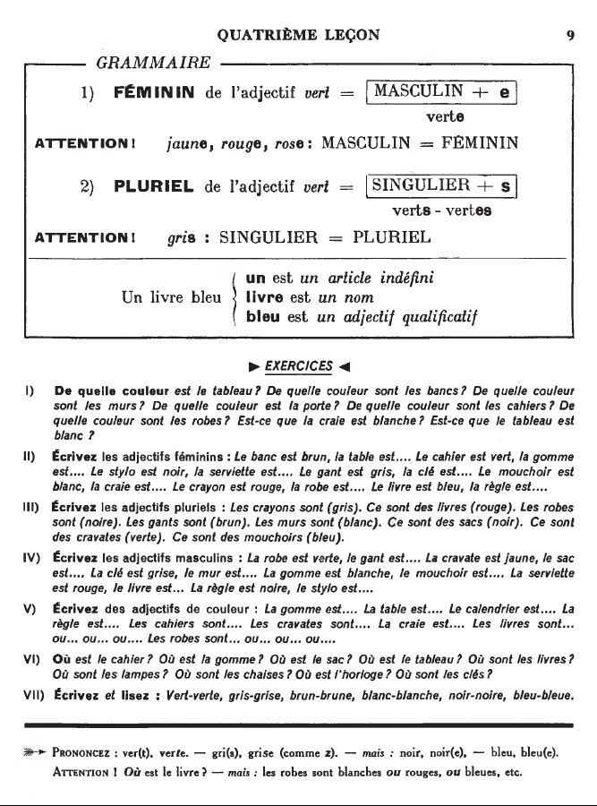

## 04. Les couleurs

  <audio controls>
    <source src="sound/04A.ogg"></source>
  </audio>

  <a href='03.html' title='Önceki sayfa'>⮜</a>&emsp;
  <a href='..' title='Ana sayfa'>⮝</a>&emsp;
  <a href='05.html' title='Sonraki sayfa'>⮞</a>

