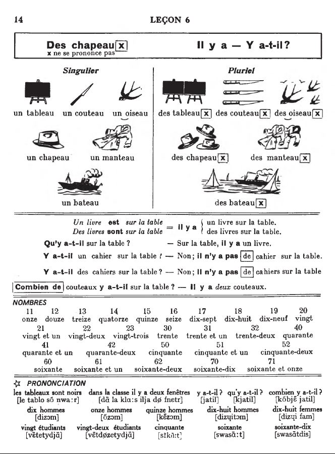
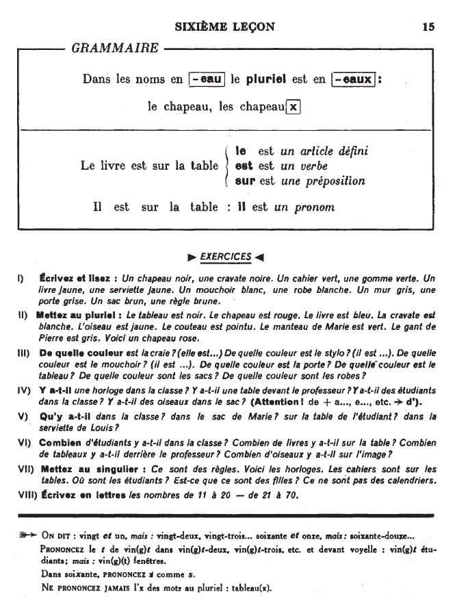

## 06. Il y a - Y a-t-il?

  <audio controls>
    <source src="sound/06A.ogg"></source>
  </audio>
  <audio controls>
    <source src="sound/06B.ogg"></source>
  </audio>

  <audio controls>
    <source src="sound/06C.ogg"></source>
  </audio>
