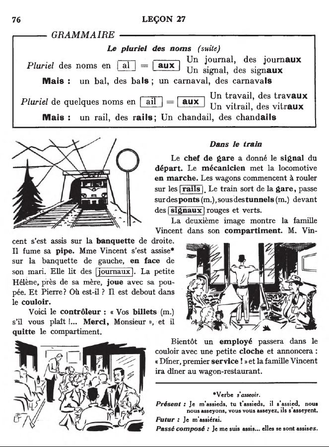
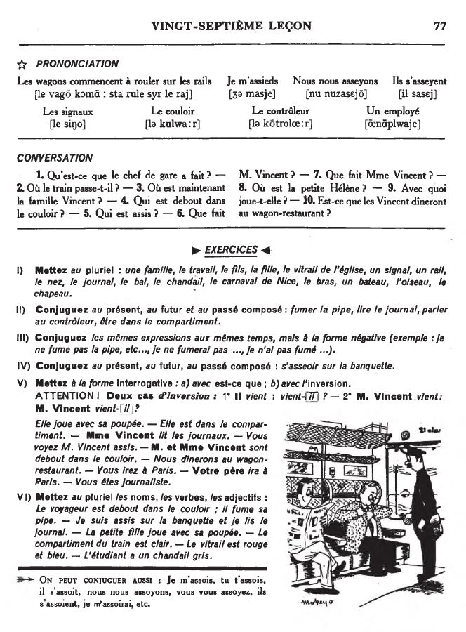

## 27. Dans le train

  <audio controls>
    <source src="sound/27A.ogg"></source>
  </audio>

  <audio controls>
    <source src="sound/27B.ogg"></source>
  </audio>

  <a href='26.html' title='Önceki sayfa'>⇦</a>&emsp;
  <a href='..' title='Ana sayfa'>⇧</a>&emsp;
  <a href='28.html' title='Sonraki sayfa'>⇨</a>

