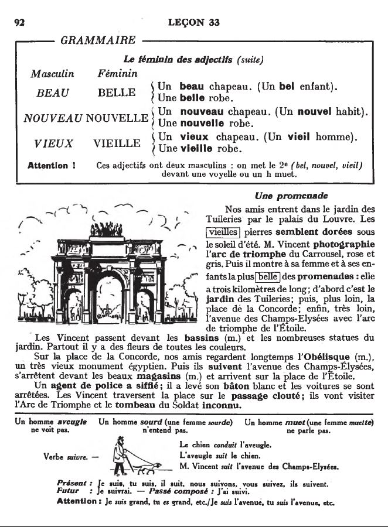

## 33. Une promenade

  <audio controls>
    <source src="sound/33A.ogg"></source>
  </audio>

Yukarıda resmi görülen, "En güzel gezinti yolu" diye nitelenen 
3 km uzunluğundaki yol: İki _arc de triomphe_ (zafer takı) arasında 
Tuileries bahçesi, Concorde meydanı, Champs-Elysées caddesi ve 
Elysée sarayı. Concorde'daki Obélisque, Sultan Ahmet meydanındaki 
Dikilitaş gibi Mısır'dan getirilmiş.
 

  <audio controls>
    <source src="sound/33B.ogg"></source>
  </audio>

<iframe width="560" height="315" src="https://www.youtube.com/embed/DWEsQJAT4xk" frameborder="0" allow="accelerometer; autoplay; encrypted-media; gyroscope; picture-in-picture" allowfullscreen></iframe>

  <a href='32.html' title='Önceki sayfa'>⇦</a>&emsp;
  <a href='..' title='Ana sayfa'>⇧</a>&emsp;
  <a href='34.html' title='Sonraki sayfa'>⇨</a>

