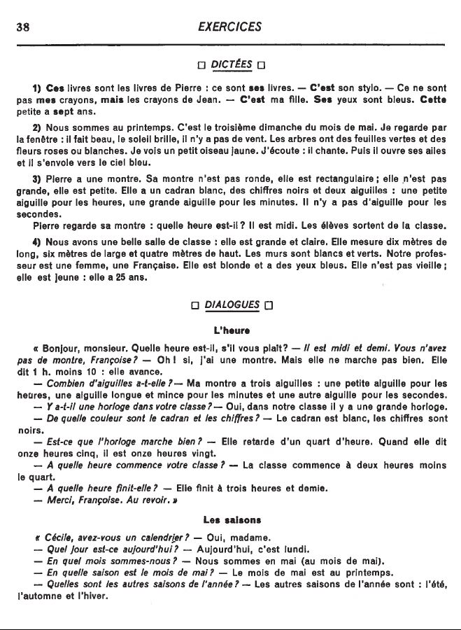
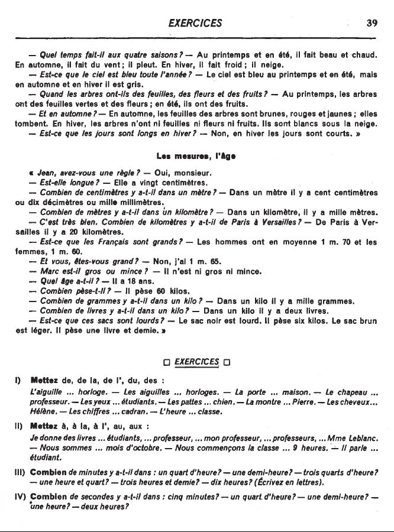

## Révision: Leçons 11 à 14

<iframe width="560" height="315" src="https://www.youtube.com/embed/PmT7cUnCnQ4" frameborder="0" allow="accelerometer; autoplay; encrypted-media; gyroscope; picture-in-picture" allowfullscreen></iframe>

<iframe width="560" height="315" src="https://www.youtube.com/embed/kzRwuV_RAGw" frameborder="0" allow="accelerometer; autoplay; encrypted-media; gyroscope; picture-in-picture" allowfullscreen></iframe>

