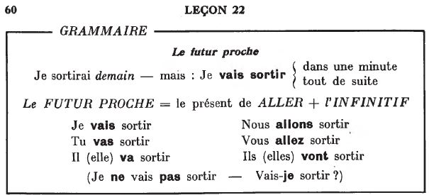
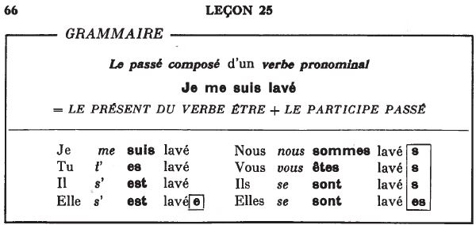

## Grammaire: Leçons 20 à 39

<audio controls>
  <source src="ders/sound/20A.ogg"></source>
</audio>

<audio controls>
  <source src="ders/sound/21A.ogg"></source>
</audio>

<audio controls>
  <source src="ders/sound/22A.ogg"></source>
</audio>

<audio controls>
  <source src="ders/sound/23A.ogg"></source>
</audio>

<audio controls>
  <source src="ders/sound/24A.ogg"></source>
</audio>

<audio controls>
  <source src="ders/sound/25A.ogg"></source>
</audio>

<audio controls>
  <source src="ders/sound/26A.ogg"></source>
</audio>

<audio controls>
  <source src="ders/sound/27A.ogg"></source>
</audio>

<audio controls>
  <source src="ders/sound/28A.ogg"></source>
</audio>

<audio controls>
  <source src="ders/sound/29A.ogg"></source>
</audio>

<audio controls>
  <source src="ders/sound/30A.ogg"></source>
</audio>

<audio controls>
  <source src="ders/sound/31A.ogg"></source>
</audio>

<audio controls>
  <source src="ders/sound/32A.ogg"></source>
</audio>

<audio controls>
  <source src="ders/sound/33A.ogg"></source>
</audio>

<audio controls>
  <source src="ders/sound/34A.ogg"></source>
</audio>

<audio controls>
  <source src="ders/sound/35A.ogg"></source>
</audio>

<audio controls>
  <source src="ders/sound/36A.ogg"></source>
</audio>

<audio controls>
  <source src="ders/sound/37A.ogg"></source>
</audio>

<audio controls>
  <source src="ders/sound/38A.ogg"></source>
</audio>

<audio controls>
  <source src="ders/sound/39A.ogg"></source>
</audio>

  <a href='alfabe.html' title='Önceki sayfa'>⇦</a>&emsp;
  <a href='index.html' title='Ana sayfa'>⇧</a>&emsp;
  <a href='gram2.html' title='Sonraki sayfa'>⇨</a>

