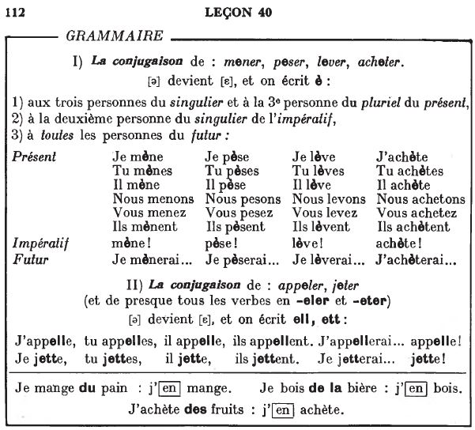
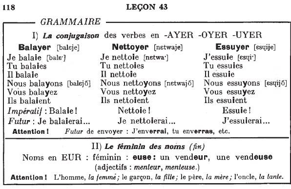
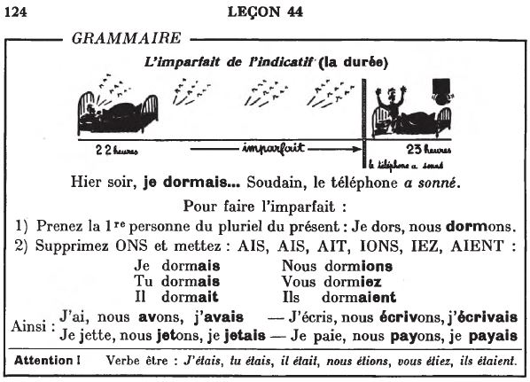
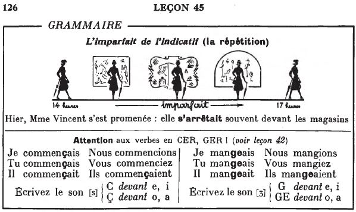
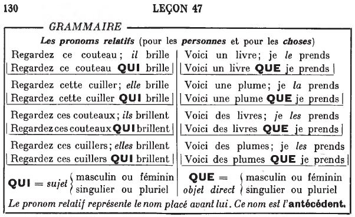
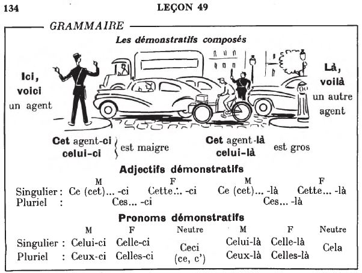

## Grammaire

<audio controls>
  <source src="ders/sound/40A.ogg"></source>
</audio>

<audio controls>
  <source src="ders/sound/41A.ogg"></source>
</audio>

<audio controls>
  <source src="ders/sound/42A.ogg"></source>
</audio>

<audio controls>
  <source src="ders/sound/43A.ogg"></source>
</audio>

<audio controls>
  <source src="ders/sound/44A.ogg"></source>
</audio>

<audio controls>
  <source src="ders/sound/45A.ogg"></source>
</audio>

<audio controls>
  <source src="ders/sound/46A.ogg"></source>
</audio>

<audio controls>
  <source src="ders/sound/47A.ogg"></source>
</audio>

<audio controls>
  <source src="gram/48.ogg"></source>
</audio>

<audio controls>
  <source src="gram/49.ogg"></source>
</audio>

  <a href='alfabe.html' title='Önceki sayfa'>⇦</a>&emsp;
  <a href='index.html' title='Ana sayfa'>⇧</a>&emsp;
  <a href='ekler.html' title='Sonraki sayfa'>⇨</a>

