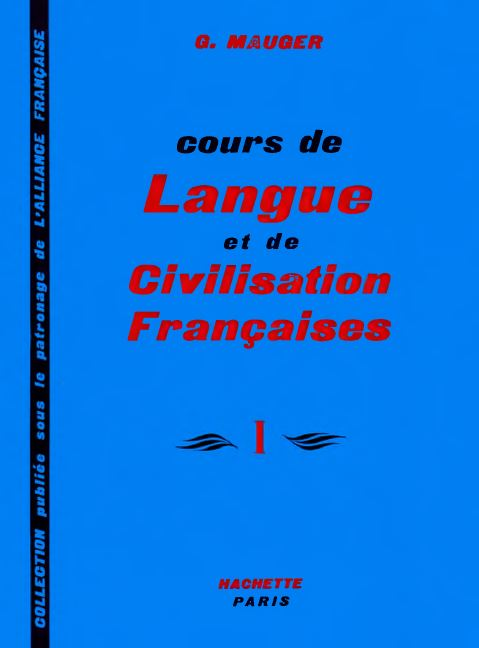

## Préface -- Takdim

Üç nesile Fransızcayı öğreten ve Fransız kültürünü tanıtan 60 yıllık klasik bir şaheserdir _Mavi Kitap_. Korona salgınında iki ay boyunca evden çıkamayınca, eski Fransızca öğretmeni Seher Eyler, öğrencilik yıllarından kalan bu kitabı sayfa sayfa okudu ve Türkçe açıklamalar ekledi. 

Geçen bunca zaman içinde daha iyi yöntemler kullanan, daha güzel kitaplar çıktığını düşünebilirsiniz. Biz de öyle düşündük ama daha iyisini bulamadık. Evet, siyah-beyaz sayfalarındaki eski resimler çok demode görünüyor, ama inanın kitabın tek eksiği bu... İçinde hatalı ya da fazlalık bir kelime bulamazsınız.

İlk derslerde sadece ses kaydı kullandık. Sonra 22. derse kadar videolar ekledik ilgili [YouTube kanalına](/JS/api/YouTube.html#PLBDiqooDrrusEA_2qV3HiyulESxXZyNcd). Mayıs ayında projeye tekrar döndüğümüzde kitap sayfalarını da web ortamına taşıdık, böylece açıklamalarda video kaydına gerek kalmadığı için yine ses dosyalarına döndük.

Her derse dışarıdan ilgili [bir video](ekler.html) ekleyerek sayfalarımıza renk ve zenginlik kattık. İki sayfalık bir dersi her gün soruları ile birlikte çalışan ciddi bir öğrenci, üç ay içinde konuşacak kadar Fransızca öğrenecektir bu sayfalardan...

  <a>⇦</a>&emsp;
  <a href='index.html' title='Ana sayfa'>⇧</a>&emsp;
  <a href='ekler.html' title='Sonraki sayfa'>⇨</a>

 
[Mavi Kitap](https://www.academia.edu/35338057/Gaston_Mauger_Cours_De_Langue_Et_De_Civilisation_Francaise_I._I_Hachette_I_Hachette)
